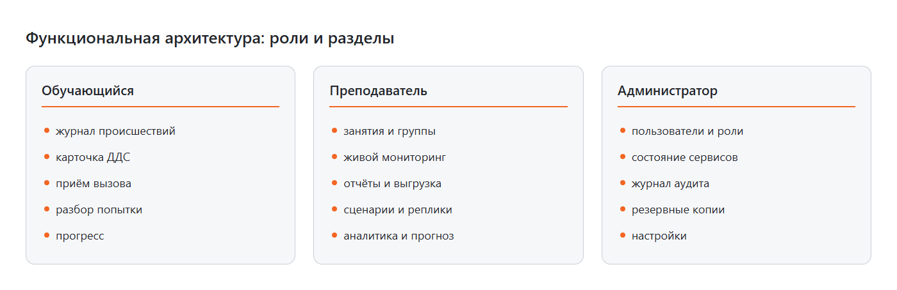
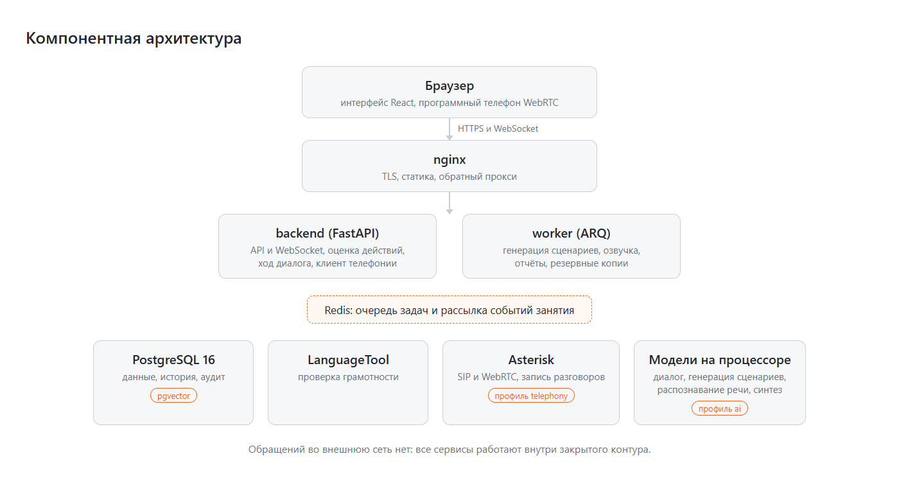

# Архитектура

Тренажёр оператора ДДС-112 работает в закрытом контуре: все компоненты, включая модели
искусственного интеллекта и телефонию, находятся внутри локальной сети учебного центра и не
обращаются во внешние сети.

## Функциональная архитектура

Система обслуживает три роли и два режима занятий.

Обучающемуся доступны журнал происшествий, карточка ДДС, приём вызова, разбор попытки и
собственный прогресс. Преподавателю доступны занятия и группы, живой мониторинг, отчёты и выгрузка,
сценарии и реплики, аналитика с прогнозом. Администратору доступны пользователи и роли, состояние
сервисов, журнал аудита, резервные копии и настройки.

**Режим «Реагирование на карточку».** Карточка происшествия приходит в журнал службы
обучающегося. Он открывает её, проверяет данные, принимает или не принимает в течение норматива,
ведёт ход работ статусами с комментариями и номером наряда.

**Режим «Приём вызова».** Обучающийся принимает звонок, роль заявителя исполняет система, и
заполняет карточку: адрес, опросную карту признаков, флаги, описание. Службы для оповещения
подставляются автоматически по классификатору.

После завершения попытки движок оценки сравнивает действия с эталоном сценария и выдаёт разбор.

## Компонентная архитектура

Браузер работает с сервером по HTTPS и WebSocket через nginx, который завершает TLS и отдаёт
статику. Запросы обслуживает `backend` на FastAPI: API, события занятия, оценка действий, ход
диалога и клиент телефонии. Фоновые задачи (генерация сценариев, озвучка, отчёты, резервные
копии) выполняет `worker`, очередь и рассылка событий идут через Redis. Данные, история и аудит
лежат в PostgreSQL с расширением pgvector, грамотность проверяет LanguageTool, телефонию ведёт
Asterisk (профиль `telephony`), модели диалога, генерации, распознавания и синтеза речи работают
на процессоре (профиль `ai`). Обращений во внешнюю сеть нет.

### Сервисы Docker Compose

| Сервис | Профиль | Назначение |
|---|---|---|
| `nginx` | всегда | TLS, статика интерфейса, прокси к `/api` и `/ws` |
| `backend` | всегда | REST API, WebSocket, оценка, диалог, клиент телефонии |
| `worker` | всегда | фоновые задачи: генерация, озвучка, отчёты, копии |
| `postgres` | всегда | база данных, расширение pgvector для поиска по методичкам |
| `redis` | всегда | очередь задач и рассылка событий занятия |
| `languagetool` | всегда | проверка грамотности текстов обучающегося |
| `backup` | всегда | ежесуточные резервные копии базы и файлов |
| `llm-dialog` | `ai` | модель, выбирающая реплику заявителя |
| `llm-gen` | `ai` | модель для генерации сценариев |
| `stt` | `ai` | распознавание речи обучающегося |
| `asterisk` | `telephony` | SIP-сервер, WebRTC, запись разговоров, интерфейс ARI |

Профили `live` и `monitoring` зарезервированы под узел с видеокартой и под связку Prometheus с
Grafana.

### Данные

| Что | Где |
|---|---|
| Пользователи, группы, занятия, попытки, оценки | PostgreSQL |
| Справочники заказчика: классификатор, службы, статусы, типичные ошибки | PostgreSQL, загружаются импортёром из файлов заказчика |
| Сценарии и их версии | PostgreSQL, тело сценария в JSONB |
| Методички для поиска и подсказок | PostgreSQL, векторные представления в pgvector |
| Записи разговоров, озвученные реплики, отчёты | том `storage` |
| Резервные копии | том `backups` |
| Журнал аудита | PostgreSQL, отдельная таблица без права на изменение и удаление |

## Масштабирование

**Вертикальное.** Больше ядер и памяти ускоряют модели и позволяют увеличить число
одновременных занятий.

**Горизонтальное.** Бэкенд не хранит состояния между запросами, поэтому его можно запускать в
нескольких экземплярах за nginx. Телефония и модели выносятся на отдельные узлы той же сети:
адреса задаются переменными окружения, код при этом не меняется. Типовая раскладка стенда:

- узел приложения: nginx, backend, worker, postgres, redis, languagetool, backup;
- узел телефонии: asterisk (открыты только SIP и диапазон медиапортов);
- узел моделей: llm-dialog, llm-gen, stt.

## Надёжность

- У каждого сервиса есть проверка работоспособности, при сбое контейнер перезапускается.
- Резервное копирование базы и файлов выполняется по расписанию, копии хранятся заданное число
  дней, восстановление проверяется скриптом `scripts/restore_test.sh`.
- Обрыв связи до 30 секунд не приводит к потере данных: черновик карточки хранится в браузере и
  на сервере, отправка идемпотентна, а события занятия догоняются по порядковому номеру.
- Журнал аудита связан цепочкой контрольных сумм, нарушение цепочки обнаруживается проверкой.

## Безопасность

- Доступ по ролям с проверкой владельца объекта на стороне сервера.
- Пароли хранятся в виде хешей, вход ограничен по числу попыток.
- Трафик внутри контура защищён TLS, голос в браузере идёт по защищённому WebRTC.
- Персональные данные минимальны: показ ФИО отдельным действием, которое пишется в журнал аудита.
- Внешние обращения запрещены на уровне конфигурации: при попытке указать внешний адрес модели
  без явного разрешения система не запускается.
