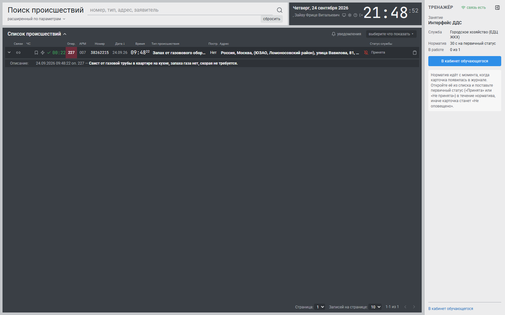
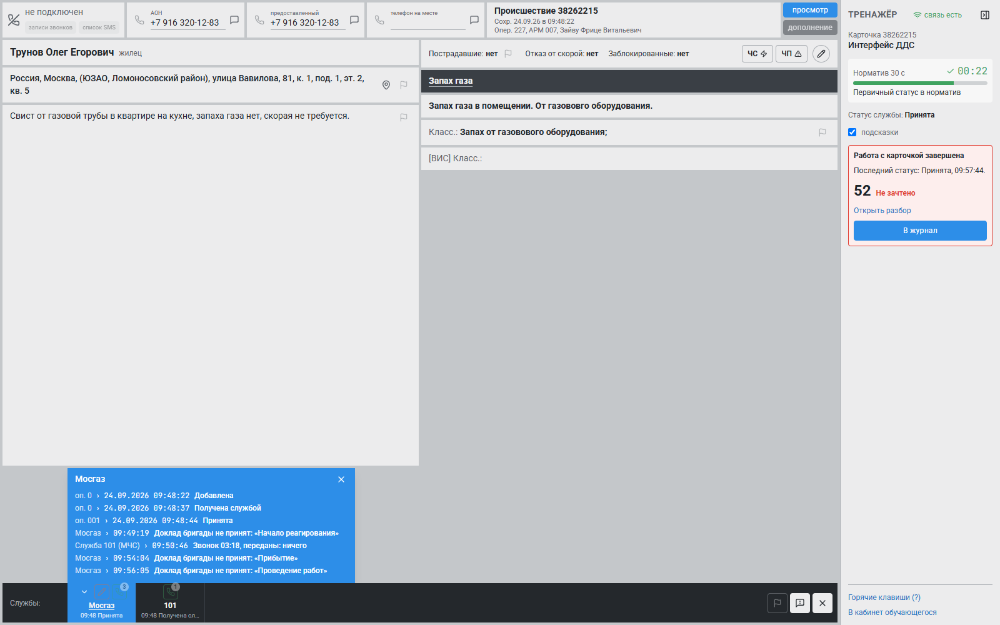
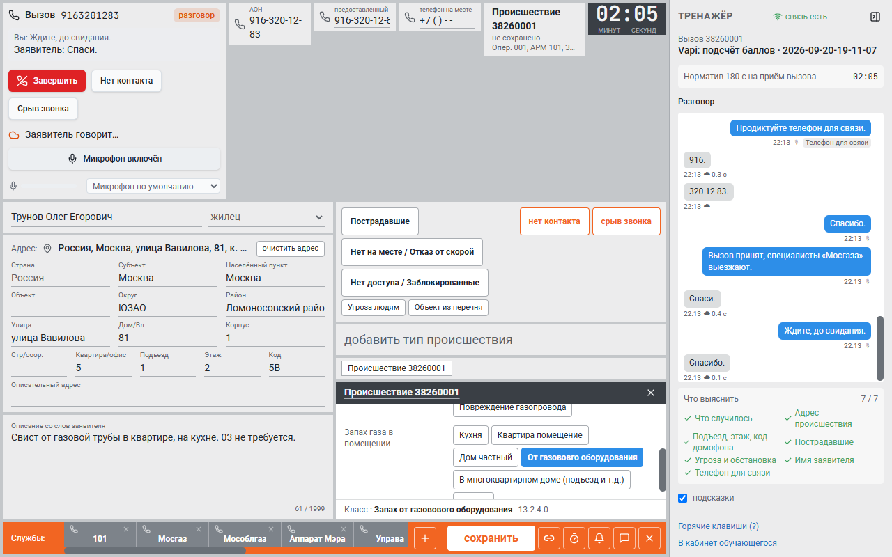
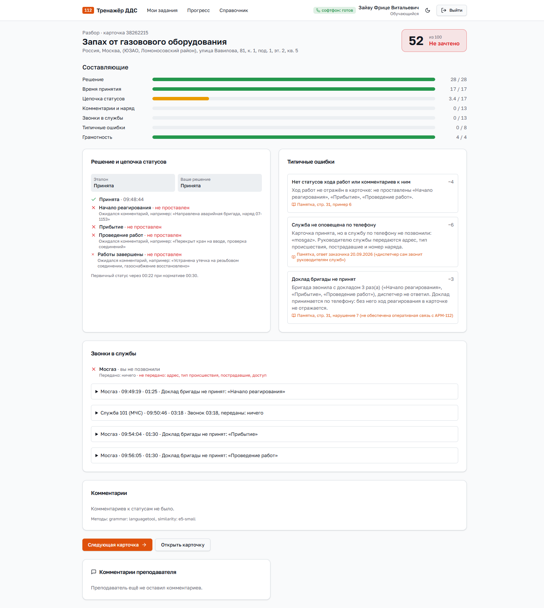
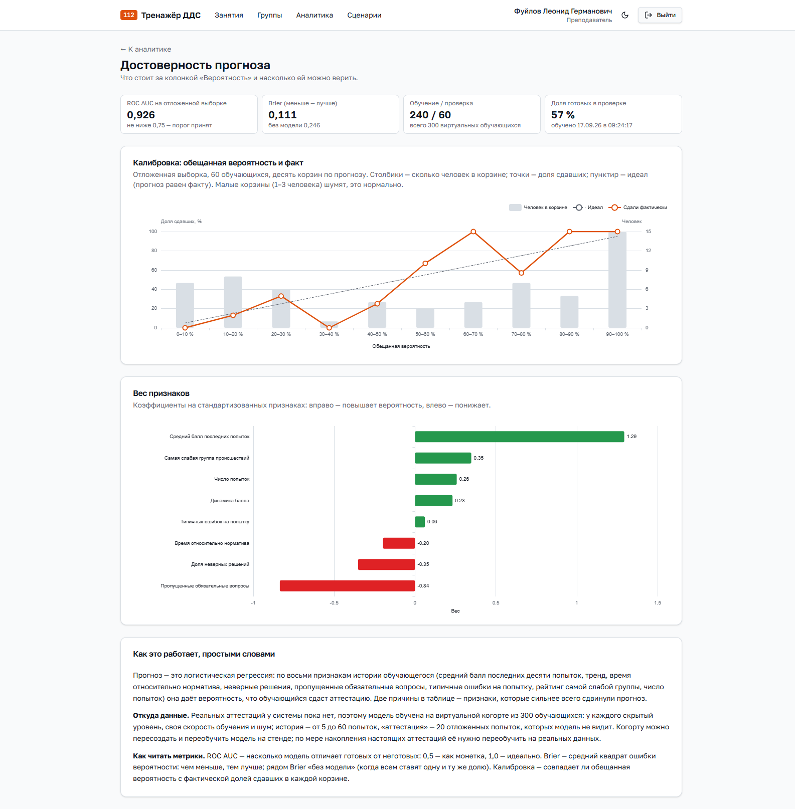

# Руководство пользователя

Как пользоваться тренажёром. Разделы по ролям: обучающийся, преподаватель, администратор.

Вход: откройте адрес системы, введите логин и пароль, выданные администратором. Если
администратор создал учётную запись с временным паролем, при первом входе система попросит
сменить пароль.

## Обучающийся

### Мои задания

После входа видно активное занятие и список назначенных. Кнопка «Перейти к рабочему месту»
открывает эмулятор.

### Рабочее место ДДС: реагирование на карточку

1. В журнале появляются карточки происшествий вашей службы. У каждой идёт таймер принятия.
2. Откройте карточку: слева заявитель, адрес и описание, справа признаки происшествия и флаги,
   внизу полоса служб.
3. Во вкладке своей службы нажмите карандаш и поставьте **«Принята»** или **«Не принята»**.
   При отказе обязательно выберите причину и напишите комментарий: что именно не в вашей
   компетенции и кому передана информация.
4. Дальше ведите ход работ по одному шагу, как на АРМ-112: «Начало реагирования» (здесь указывается номер наряда), «Прибытие»,
   «Проведение работ», «Работы завершены». Комментарий поясняет, что сделано.
5. Если работы не проводились, поставьте «Отказ от выполнения работ» с комментарием.
6. В ходе реагирования вы звоните дежурному службы и передаёте карточку голосом. Бригада
   выезжает после звонка, в котором назван адрес; её доклады («Прибытие», «Проведение работ»)
   приходят в панель звонков и остаются в ней после завершения разговора. Отражайте их
   статусами в карточке.

Горячие клавиши: `Alt+A` принять, `Alt+R` не принять, `Ctrl+Enter` сохранить, `?` подсказка.

**Важно:** первичный статус нужно поставить в течение норматива, по умолчанию 30 секунд. Если не
успеть, карточка получает отметку «Не оповещено», и это учитывается в оценке.

### Рабочее место оператора: приём вызова

1. Поступает вызов, нажмите «Ответить».
2. Разговаривайте с заявителем: говорите в гарнитуру или пишите в поле разговора. Спрашивайте по
   существу: что случилось, точный адрес, есть ли пострадавшие, есть ли угроза, как зовут
   заявителя.
3. Заполняйте карточку по ходу разговора: фамилия и статус заявителя (очевидец, пострадавший,
   родственник, знакомый, ребёнок, участник), адрес (округ и район подставятся по улице),
   описание со слов заявителя.
4. Тип происшествия: наберите часть слова в строке «что случилось?» — «газ оборуд» найдёт «Запах
   от газового оборудования», Enter выберет первый вариант, опросная карта заполнится сама;
   либо «по группам» и дальше по кнопкам. Пока тип не выбран, под картой написано, что уточнить.
5. «Пострадавшие» спросит, сколько их. Службы подставятся автоматически по признакам; «+» в
   полосе служб открывает окно «Добавьте службы» с поиском — автоматические подсвечены синим и
   не снимаются, остальные добавляются и убираются щелчком, «Сохранить и закрыть».
6. Если заявитель бросил трубку или связи нет, отметьте это кнопками «срыв звонка» или «нет
   контакта».
7. Нажмите «Сохранить» и подтвердите «Оповестить и сохранить карточку» (Ctrl+Enter дважды).

### Разбор

Сразу после завершения открывается разбор: итоговый балл, из чего он сложился, что сделано верно,
какие ошибки сработали и почему, время против норматива, стенограмма разговора и запись. Читайте
объяснения: они написаны словами памятки, по которой работают настоящие диспетчеры.

### Мой прогресс

Динамика баллов, время, сильные и слабые группы происшествий, частые ошибки и рекомендации.

### Справочник

Памятка «Работа на АРМ-112» целиком, постранично, и методические материалы, которые загрузил
преподаватель, — тоже целиком. Ниже поиск по словам сразу по памятке, материалам и
классификатору происшествий; из результата открывается сам документ.

## Преподаватель

### Занятие

1. «Занятия» → «Создать».
2. Выберите режим (реагирование на карточку или приём вызова), группу, категории происшествий,
   сложность, профиль службы, норматив и порог зачёта. Подсказки можно выключить для аттестации.
   Галочка «Звонки на телефон обучающегося» включает настоящую телефонию для этого занятия:
   вызовы идут на телефон обучающегося через оператора связи. Без галочки занятие работает в
   браузере на софтфоне.
3. «Начать занятие»: обучающиеся получают карточки или вызовы.
4. Во время занятия открыт живой мониторинг: у каждого обучающегося видно состояние, таймер и
   последний балл. Можно открыть его попытку и смотреть в реальном времени.
5. «Завершить занятие», затем «Отчёт».
6. Ненужное занятие можно удалить: отметьте свои незавершённые занятия и «Удалить». Вместе с
   занятием удаляется его история (попытки, оценки, комментарии, записи разговоров), рейтинги
   пересчитываются по оставшимся оценкам, действие фиксируется в журнале аудита. Идущее занятие
   удалить нельзя.

### Отчёт

По каждому обучающемуся: число попыток, средний балл, среднее время, отклонение от норматива,
ошибки и грамотность. Строка раскрывается до отдельных попыток; у попытки колонка «Действия»
раскрывает, что обучающийся делал и когда: статусы с нарядом и комментарием, отметки ошибок в
карточке, звонки в службы, в приёме вызова — вопросы заявителю. Отчёт выгружается в PDF, Excel
и CSV, действия попадают в выгрузку.

Оценку можно изменить, указав причину: исходная оценка сохраняется, изменение фиксируется в
журнале аудита и видно обучающемуся.

### Сценарии

- «Сгенерировать»: опишите ситуацию фразой, выберите тип и сложность. Система подготовит сценарий:
  лист фактов заявителя, его реплики и эталон.
- Прослушайте реплики, поправьте текст, при необходимости загрузите свою запись голосом.
- «Что исправить» плюс «Переделать»: система учтёт замечание и сделает новую версию, прежние
  сохранятся.
- «Проверить грамотность» подсветит ошибки в текстах.
- «Утвердить» целиком или по частям. Только утверждённые сценарии попадают в занятия.
- «Удалить»: сценарий, по которому никто не занимался, удаляется совсем; сценарий из прошлых
  занятий уходит в архив (фильтр «Статус: В архиве»), чтобы разборы этих занятий остались
  открытыми. Из архива сценарий можно «Восстановить».
- Сюда же можно загрузить методические материалы (PDF, DOCX, TXT): обучающиеся читают их в
  «Справочнике» целиком и находят поиском, а генерация сценариев учитывает их как контекст.

### Аналитика

Тепловая карта группы по категориям происшествий, динамика, типичные ошибки с пояснением, прогноз
готовности к аттестации по каждому обучающемуся с объяснением, почему прогноз такой. Отдельная
страница «Достоверность прогноза» показывает, насколько прогнозы совпадали с фактом.

## Администратор

- **Пользователи:** создание, роль, служба, блокировка, сброс пароля. Фамилия и имя скрыты, показ
  фиксируется в журнале аудита.
- **Состояние системы:** сервисы, нагрузка, активные занятия и звонки, оповещения о сбоях.
- **Журнал аудита:** фильтры по пользователю, действию и дате; кнопка «Проверить целостность»
  подтверждает, что записи не изменялись.
- **Резервные копии:** список, создание копии вручную, расписание.
- **Настройки:** телефония, журналирование, параметры копирования.

Администратор намеренно не может менять оценки и сценарии: это зона преподавателя.

## Если что-то не работает

| Что видно | Что делать |
|---|---|
| Не приходит вызов | Проверьте статус телефонии в шапке; он должен быть «доступен» |
| Заявителя не слышно | Проверьте выбор устройства и разрешение браузера на микрофон |
| Заявитель отвечает невпопад | Переформулируйте вопрос короче; сообщите преподавателю, он добавит реплику |
| Карточка не сохраняется | Проверьте обязательные поля, они подсвечены |
| «Карточка уже закрыта» | Занятие завершено преподавателем или карточка отправлена ранее |
